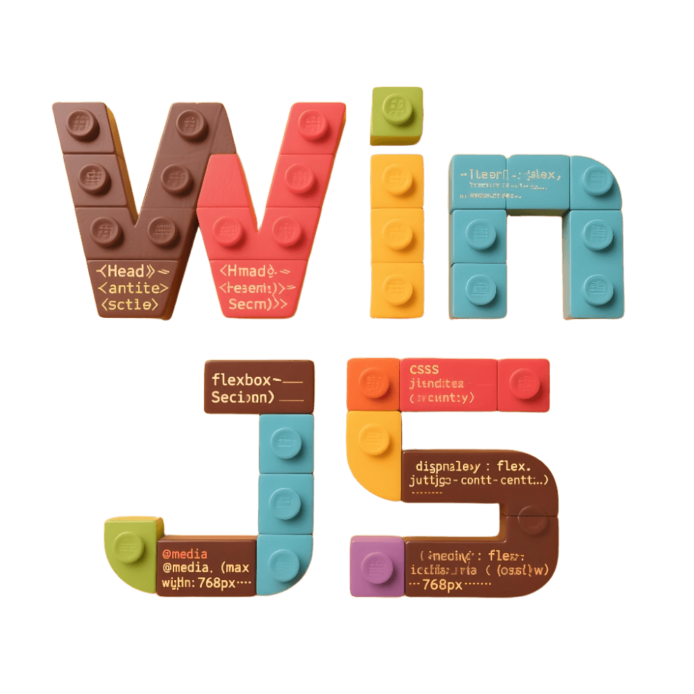

# WinJS Documentation

<p align="center">
  
</p>

<p align="center">
  <strong>WinJS - A Scalable Vue.js Frontend Application Framework</strong>
</p>

<p align="center">
  <a href="https://nodejs.org/">
    
  </a>
  <a href="LICENSE">
    
  </a>
  <a href="https://app.netlify.com/projects/winjs-docs/deploys">
    
  </a>
</p>

English | [简体中文](./README.zh-CN.md)

## 📖 About This Project

This is the official documentation site for the WinJS framework, built with [VitePress](https://vitepress.dev/). The documentation provides comprehensive usage guides, API references, plugin development guidelines, and more for the WinJS framework.

## ✨ Introduction to WinJS

WinJS is a scalable frontend application framework, forked from UmiJS and specifically designed for the Vue.js ecosystem. It provides a complete frontend development solution with full-lifecycle support from project initialization to production deployment.

### Core Features

- 💎 **Simplicity First** - Built-in routing, state management, build tools, and deployment - only one dependency needed for development
- 🎁 **Feature Rich** - Supports multiple application types including Web apps, plugins, mini-programs, H5, and offline packages
- 🎉 **Extensible** - Complete plugin lifecycle with all features extensible through plugins
- ⚖️ **Multiple Build Engines** - Supports various build solutions including Vite, Webpack, and Rsbuild
- 🌴 **Complete Routing** - Based on vue-router with support for nested routes, dynamic routing, and code splitting
- 🚄 **Future Ready** - Built on Vue 3.0, embracing the latest frontend technologies

## 🚀 Quick Start

### Prerequisites

- Node.js >= 18
- pnpm >= 7.4.0 (recommended) / npm >= 8 / yarn >= 1.x

### Create Project

```bash
# Using pnpm (recommended)
pnpm dlx @winner-fed/create-win@latest

# Using npm
npx @winner-fed/create-win@latest

# Using yarn
yarn create @winner-fed/win
```

### Local Development

```bash
# Install dependencies
pnpm install

# Start development server
pnpm dev

# Build for production
pnpm build
```

## 📚 Documentation Structure

```
src/
├── api/              # API Reference Documentation
├── guides/           # Development Guides
│   ├── getting-started.md    # Quick Start
│   ├── introduce.md          # Framework Introduction
│   ├── build.md             # Build Configuration
│   ├── routes.md            # Routing Configuration
│   └── ...
├── config/           # Configuration Documentation
├── cli/              # CLI Commands
├── plugins/          # Plugin Documentation
└── blog/             # Blog Articles
```

## 💻 Running Documentation Locally

### Environment Setup

Ensure Node.js 18+ and pnpm 7.4+ are installed.

### Install Dependencies

```bash
pnpm install
```

### Start Development Server

```bash
pnpm dev
```

Visit http://localhost:5173 to view the documentation.

### Build Documentation

```bash
pnpm build
```

The build artifacts will be generated in the `.vitepress/dist` directory.

## 🤝 Contributing

We welcome contributions from the community! If you'd like to help improve the documentation:

1. Fork this repository
2. Create your feature branch (`git checkout -b feature/AmazingFeature`)
3. Commit your changes (`git commit -m 'Add some AmazingFeature'`)
4. Push to the branch (`git push origin feature/AmazingFeature`)
5. Open a Pull Request

### Documentation Standards

- Write documentation in English
- Follow Markdown syntax standards
- Code examples should be complete and runnable
- Update relevant navigation when adding new content

## 📄 License

This project is open source under the [MIT License](LICENSE).
